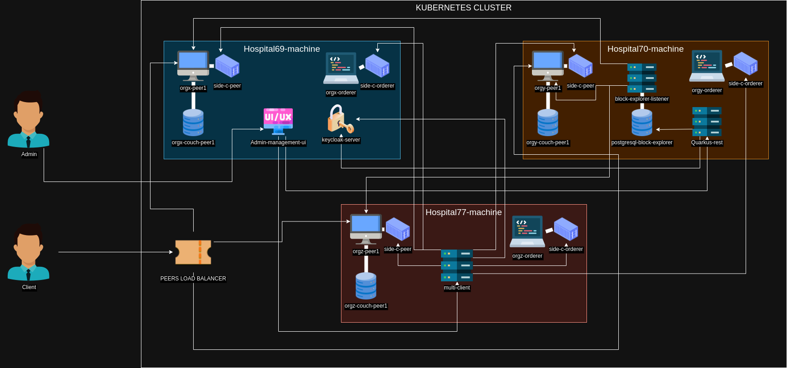

# Info
## This is a repository to put all together from the tesis
## We will describe the final output here
# Prototypes repositories / Theory
## [First hlf prototype hospital##zero](https://github.com/pedromnchunks35/hlf##zero)
## [Sec repository hospital2](https://github.com/pedromnchunks35/hospital2)
## [Benchmarking theory](https://github.com/pedromnchunks35/hyperledger##benchmarking)
## [A base network prototype](https://github.com/pedromnchunks35/benchmarking##base##network)
## [First installation in a hospital](https://github.com/pedromnchunks35/hospital##installation/tree/main)
## [A mock for chaincode](https://github.com/pedromnchunks35/generic##mock/tree/main)
## [Theory about general blockchain condepts](https://github.com/pedromnchunks35/article##for##chairs)
## [Some articles that we may need to read after finishing the prototype for tesis](https://github.com/pedromnchunks35/articles##thesis)
## [Go prototype to get data from protobuf serialized data in the block explorer app](https://github.com/pedromnchunks35/hlf##qscc##data##wrapper)
## [Side container project for the multi client](https://github.com/pedromnchunks35/hlf##multi##client##image)
## [Side Container project for the orderer](https://github.com/pedromnchunks35/hlf##orderer##grpc##side##container##image)
## [Side Container project for the peer](https://github.com/pedromnchunks35/hlf##grpc##peer##side##container)
## [Main repository for kubernetes implementation of the network, also we have here our block explorer prototype, Istio,jenkins,metallb,etc..](https://github.com/pedromnchunks35/docker##documentation)
## [Hot reload quarkus inside of kubernetes cluster](https://github.com/pedromnchunks35/quarkus##hot##reload##inside##cluster)
## [Tesis Web Prototype](https://github.com/pedromnchunks35/tesis##web)
## [Keycloak basics](https://github.com/pedromnchunks35/keycloak##basis)
## [Quarkus rest with keycloak and also grpc](https://github.com/pedromnchunks35/microservice##full##java)
## [Metrics,measures,future incrementations and network constitution of the benchmarking](https://github.com/pedromnchunks35/hospital##installation##kubernetes)
# Final Architecture

## Peer
- Peers have 1 db that retains all the ledgers (org*-couch-peer*)
- Peers have 1 side container
## Orderer
- Orderer have 1 side container
## Multi-client
- The sigle point used to communicate with all the side containers (either peer side container or orderer side container)
## Peers Load Balancer
- Gateway to access one of the peers inside of this internal network (in this case to access one of the 3 peers present there in a robin-hood fashion)
## Side Containers
- Either of type peer or type orderer but both serve the same thing: middleware of communication between the multiclient and each component of the network
## Block-explorer-listener
- A service that stores events from the blockchain in a postgresql database
## Quarkus-rest
- A service to access data from the block explorer db and pass it to the UI 
- This uses Rest
## Keycloak-server
- To store users credentials (at the moment just for admins, maybe it can be used in the future to users as well)
- It also creates tokens that allows us to access certain services
- We can login as a admin in both multi-client and quarkus-rest
- The token retrieved from multi-client or quarkus-rest can be used to access either the multi-client and the quarkus-rest
## Admin-management-ui
- Enables a admin to manage and visualize the network
- At the moment features
  - Visualize block explorer data
  - Visualize resources data
  - Interact with each main component (orderer and peer) with default and custom commands for more fined control
  - Access documentation
  - Access project website
- Future prob functions
  - Add/Remove components
## Omited components
### Cadvisor
- Currently we have a CADVISOR per machine so we can gather measures from it
### Prometheus Server
- This serves to collect data from CADVISORS that are placed at each component to check resource consumption